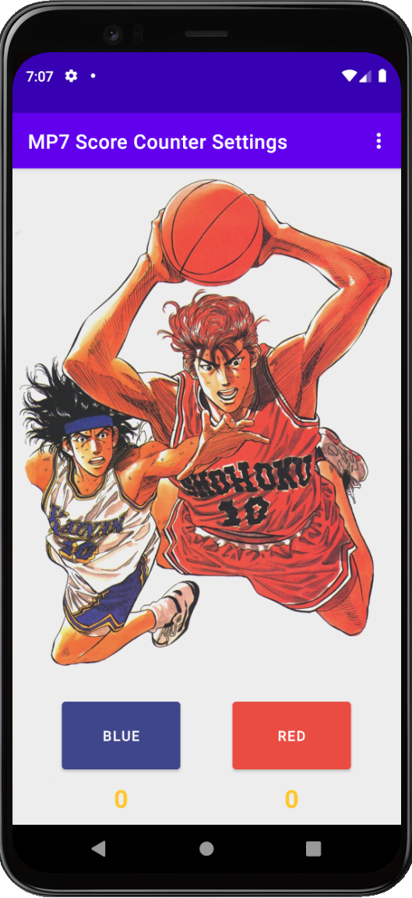

# score-counter

An app that allows the user to keep track of the scores of two different teams and displays the winning team that reaches a score of 5.

This app contains the Main Activity which has the 2 teams with their score initially being 0 and are incremented every time their button is clicked. The WinnerActivity is triggered with an intent and is sent the name of the winning team and the number points they won by. The app also uses an implicit intent that allows the user to send a message with the name of the winner and points they won by. There are also custom settings that lets the user retain their preferences for the main and winner activity background.

I also have a video playlist where I go over the details of the app and show the app itself.
https://youtube.com/playlist?list=PLE49evUtQ2WNRzPJvKOHm0-CT3WoW5DYZ

